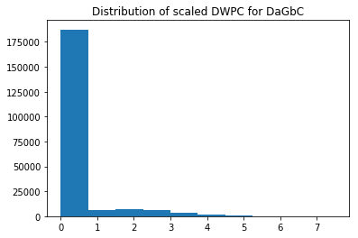
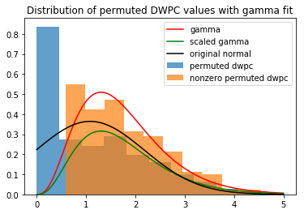

## Methods and results

### Computation tools

The project uses Python version 3.6.6 [@url:https://www.python.org/downloads/release/python-366/] and several open-source scientific packages.
Among these are NumPy [@url:http://www.numpy.org/], a package we used for its n-dimensional arrays and mathematical functions, SciPy [@url:https://www.scipy.org/], a package from which we used sparse matrices, mathematical functions, and statistical distributions, and pandas [@url:http://pandas.pydata.org/], an open source data manipulation library.
Our project made frequent use of Jupyter notebooks [@url:http://jupyter.org/] for the visualization of computations and results.

### Heterogeneous network storage format

In the past, our project has loaded Hetionet (the heterogeneous network of biomedical data) from a GitHub repository, where the network is stored in JavaScript Object Notation (JSON) format.
Every time the network was loaded, a compressed JSON file had to be downloaded, decompressed, and loaded by Python.
The use of an adjacency matrix required its recomputation.
As this operation is ubiquitious throughout the project, its slowness had become a time sink.
The solution to this problem is the so-called HetMat, a new storage format for heterogeneous networks in which adjacency matrices and node metadata are stored as compressed sparse matrices locally on disk, alongside a JSON document indicating the network connection types.
This format has major speed advantages over the previous method and has been implemented as a module and object type in the Hetmech package.

### Numerical approximations to complex computations

My biggest challenge last summer was the implementation of more complete functionality to compute the degree-weighted path count (DWPC), a feature we use to determine the connctedness of two nodes.
Graph paths differ from walks in that they cannot contain self loops.
While this difference greatly denoises the feature-- especially at longer path lengths-- it significantly complicates feature computation.
Walk counts can be calculated by multiplying an adjacency matrix by itself (or others) as many times as steps desired.
Path count computation must subtract those steps that would traverse previously-traversed nodes.
For relatively short paths, we have developed simple linear algebra solutions to remove self loops.
On longer paths, though, this pruning tremendously complicates the computation.
To help combat this, I implemented DWPC approximation methods that trade some remaining self-loops from network traversals for far faster computation speed.

### Recursive computation to enable caching

When performing bulk DWPC computations on the network, many path-type segments are repeated frequently.
For example, suppose we have to compute DWPC for the following two path-types (metapaths): [Compound-binds-Gene-interacts-Gene-associates-Disease, Compound-causes-Side_Effect-causes-Compound-binds-Gene-interacts-Gene-associates-Disease] for short, [`CbGiGaD`, `CcSEcCbGiGaD`].
Ordinarily these would be computed as follows:

1. Split the metapath into individually-computable segments
`CcSEcCbGiGaD` -> [`CcSEcC`, `CbG`, `GiG`, `GaD`] and `CbGiGaD` -> [`CbG`, `GiG`, `GaD`]
2. Compute DWPC over each segment
3. Multiply resulting matrices to return full DWPC matrix

An ineffeciency in computing these two metapaths is that the segment `CbGiGaD` will be computed twice.
The more efficient procedure is to compute DWPC for `CbGiGaD`, and then to compute `CcSEcC` and multiply by a cached result for `CbGiGaD`.
To facilitate this optimization, we implemented a combination memory and disk cacher, along with a recursive DWPC computation method to take better advantage of caching.
These improvements dramatically reduced computation time, especially when computing hundreds or thousands of DWPCs.

### Estimation of the null distribution

Before this summer, the null distribution for a single DWPC within Hetionet had to be estimated from a total of five draws from the distribution.
This led to the situation in which a DWPC value is nonzero, while all draws from its null distribution are zero.
For such cases, the previous significance test method would return infinite test statistics, giving p-values of zero.
To provide a better approximation of the null distribution for any computed value, as well as to eliminate the persistence of these zero p-values, I computed 195 more randomized networks, for a total of 200 randomized networks.
The significance of any computed DWPC value in Hetionet, now, was computed by comparing the value to 200 draws from the null distribution, ie. the distribution of DWPC values when the network connectivity is meaningless.
With null distribution values highly zero-inflated due to network sparsity, even 200 draws was often not enough to eliminate zero p-values.
We developed a technique to dramatically increase the number of draws from the null distribution, without needing any further network randomization, a computationally intensive and extremely slow process.
To understand how these values were obtained, a quick explanation of network randomization is required.

### Degree-grouped permutations

Networks consist of nodes and edges.
Each edge type in our network (eg: Compound-treats-Disease) can be represented by an adjacency matrix or an edge list.
Nodes have degree, specific to each edge type in which their node type participates.
For example, a compound could have degree three along the Compound-treats-Disease edge-type, indicating that it is a known treatment for three diseases, as well as degree two along the edge-type Compound-causes-Side_Effect, indicating the compound is a known cause of two side effects.
To generate a random or 'permuted' network, the X-Swap algorithm picks two edges and attempts to swap the targets between the sources.
If no node degrees change, the edges are accepted, and new edges are picked.
Through many such degree-preserving edge swaps, we can generate randomized networks with the same degree sequences as the actual network.
Because this randomization procedure preserves nothing but node degree, though, we can increase the number of draws from the null distribution by grouping random network DWPC values by their source and target degree.
For example, suppose that along the Compound-treats-Disease edge-type there are edges between compound A and disease B, as well as compound C and disease D, where A and C share out-degree and B and D share in-degree along the edge type.
When generating the null distribution for DWPC values between A and B, we can use DWPC values for A-B and C-D in every permuted network, thereby doubling the effective number of permutations or draws from the null distribution.
In some cases, this method can give many thousands of null-distribution draws using only 200 randomized networks.
This procedure is referred to as degree-grouped permutations (DGP).

A typical distribution is shown in Figure @fig:raw_dist below.

{#fig:raw_dist width="3in"}

The distribution of the nonzero values from the above figure are more visible when omitting zeros.

{#fig:dist_nz width="3in"}

In the past, significance has been determined by the following method:

Let $d$ be the observed DWPC value calculated between two nodes, $n_a$ and $n_b$, and let $p_i$ be the $m \geq 200$ DGP values in the randomized networks between $n_a$ and $n_b$.
Then set the mean and unbiased sample variance, using Bessel's correction.
$$\bar{x} = \frac{\sum_{i=1}^{m} p_i}{m}$$
$$s^2 = \frac{1}{m-1} \sum_{i=1}^{m} (p_i - \bar{x})$$
From these, the test statistic $z$ was computed.
$$z = \frac{d - \bar{x}}{s}$$
$z$ is similar to the Z-score for an observed value of a normal distribution, but as shown in the following section, the data do not follow the assumption of normality.

### Gamma hurdle model

A conceptual advance I made this summer was an improved way to model the distribution of permuted network DWPC values, a distribution I called the gamma hurdle.
The previous method, as discussed in the last section, somewhat captured the right-tail behavior of the distribution, but overall represented a very different distribution.
In Figure @fig:dist_comp below, the blue histogram represents the overall distribution of DGP values, ie. the null distribution for a given degree combination in the network.
The black line represents the old model, showing decent fit along the right tail, but clearly failing to model the blue distribution accurately overall.
In comparison, the orange histogram represents the nonzero values of the null distribution, with the red line indicating the gamma distribution fit.
While not perfect, the similarity is greater, and the right-tail fit is far superior.
The green line represents this fit scaled to the gamma hurdle model, in which the nonzero values are approximated by the gamma distribution, while the zero values are represented as a draw from a Bernoulli distribution with parameter $\lambda$.

{#fig:dist_comp width="4in"}

The gamma hurdle model has three parameters, $\alpha$, $\beta$, and $\lambda$, which can be estimated for any degree combination by the DGP values-- draws from this distribution.
Given metapath $M$, the nodes of given source and target degree $s,\ t$\ have randomly distributed DWPC values $\delta_{M, s, t}$ ($\delta$ for simplicity) in permuted networks.
These values can be modeled by a modified gamma distribution, called the gamma-hurdle ($\Gamma_H$) distribution.

$$\delta \sim \Gamma_H(\alpha, \beta, \lambda)$$
$$\Rightarrow P(\delta = 0) = 1 - \lambda$$
$$\Rightarrow \delta \mid \delta \neq 0 \sim \Gamma(\alpha, \beta)$$

Thus, given an observed DWPC value $d$, the probability of a more extreme value under the null hypothesis in a one-sided test (p-value) is

\begin{align*}
    p = P(\delta \geq d) &= P(\delta \neq 0)\ P(\delta \geq d \mid \delta \neq 0) \\
    &= \lambda\ (1 - \frac{\gamma(\alpha, \beta x)}{\Gamma(\alpha)}) \\
    &= \lambda \frac{\Gamma(\alpha, \beta x)}{\Gamma(\alpha)}
\end{align*}

We can estimate the parameters $\lambda, \alpha$, and $\beta$ using the sample mean and sample variance.
To compute these quantities, given $m$, the number of degree-grouped permutations (sample size), let $\{\delta_1, ..., \delta_m\}$ be observed values of DWPC for a single source, target degree combination, and let $p$ be its nonzero values: $p = \{x : x \in \{\delta_1,...,\delta_m\}\ \mathrm{and}\ x > 0\}$. Then the permuted DWPC values have positive sample mean $\bar{\delta}^\dagger$ and unbiased sample variance $s^2$. Note that these are the mean and variance of the nonzero values only.

\begin{align*}
    \bar{\delta}^\dagger &= \frac{\sum_{=1}^m \delta_i}{|p|} \\
    s^2 &= \frac{\sum_{i=1}^m \delta_i^2 - (\sum_{i=1}^m \delta_i)^2 / |p|}{|p| - 1}
\end{align*}

Since $E[\delta \mid \delta \neq 0] = \frac{\alpha}{\beta}$ and $\mathrm{Var}(\delta \mid \delta \neq 0) = \frac{\alpha}{\beta^2}$, we can solve the two equations to find $\alpha$ and $\beta$.

\begin{align*}
    \lambda &= \frac{|p|}{m} \\
    \beta &= \frac{\bar{\delta}^\dagger}{s^2} \\
    \alpha &= \bar{\delta}^\dagger \beta
\end{align*}

Thus knowing only the fraction of $\delta_i$ that are nonzero, and the mean and variance of nonzero values, we can find all three parameters of the gamma hurdle model.

