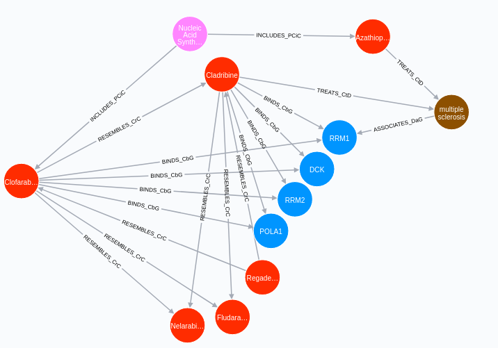

## Next steps

Previous heterogeneous network methods were able to identify the most significant potential connections along a given path-type [@doi:10.7554/eLife.26726; @doi:10.1371/journal.pcbi.1004259].
With the methods developed this summer, a two-node query can be translated into a ranked list of path-types or the actual network connections themselves.
Overall, we developed a more robust way to compare the connections between two nodes across path-types.
We imagine developing a front-end system for this method in which a user can query two nodes in the network and be returned an interactive portion of the network displaying the top connections.
For example, given the node pair Clofarabine and multiple sclerosis, we can output an interactive graph portion as shown in Figure @fig:graph below.

{#fig:graph width="4.5in"}

While our computation methods have been repeatedly optimized over the last two years, real-time computation remains impossible.
Therefore, in order to build an interactive, user-friendly front-end for the Hetionet two-node query system, we require a more robust back-end database, containing pre-computed information about the connectedness of node pairs.
The first step in building such a database has begun-- the computation of DWPC on Hetionet and the 200 permuted networks for all paths up to four edges length.
We expect that this computation will require at minimum several weeks to complete.
Because the size of these data could easily be several terabytes, we will likely filter to retain only information about connections above a threshold level of significance.
Finally, these data will be placed into a web-accessible relational database so that a front-end software developer can integrate the database easily into a website with search functionality.

The methods we have developed are not specific to biomedical heterogeneous networks.
We hope, therefore, that methods we have developed will prove useful in other potential heterogeneous network applications, such as social networks analysis.
To increase the scale of the Hetionet network could be useful.
Work is underway to greatly increase the size of Hetionet by mining connections from the literature.
Another potential project would involve rebuilding Hetionet from updated versions of the original data sources.
A larger network could afford greater coverage of existing biomedical knowledge.
Specifically, a network that includes less biased data sources such as high-throughput screening data could mitigate the effects by which high-interest nodes have many connections while much of the network is low-degree.
Overall, my work with the heterogeneous network project has dramatically increased computation speed, allowed greater path-type flexibility, improved statistical modelling of underlying processes, and assisted the development of a large-scale database containing connectivity information of nodes in heterogeneous networks.